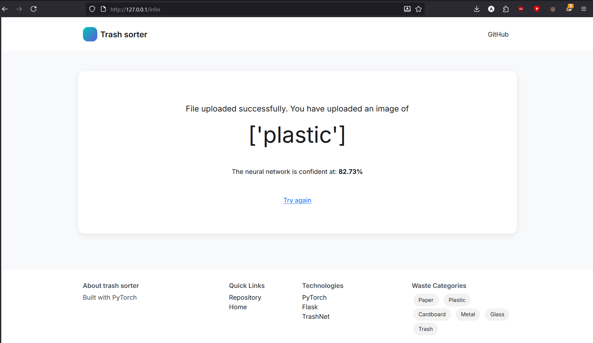

# 🗑️ Smart Dustbin - AI Waste Sorting

AI-powered waste classification app that automatically sorts waste into 6 categories: Paper, Plastic, Cardboard, Metal, Glass, and Trash.


## Screenshots




## Features

- Real-time waste classification
- 6 waste categories with confidence scores


## Tech Stack

- Flask (Backend)
- PyTorch (ML Model)
- Pre-trained model

## Installation

```bash
# Clone repo
git clone https://github.com/SuchDelay/trash_sorter
cd trash_sorter

# Install dependencies
pip install -r requirements.txt

# Run
python app.py
```

That's it! Open `http://127.0.0.1:80` in your browser.

## Requirements

```
Flask
torch
torchvision
Pillow
numpy
Werkzeug
```

## Usage

1. Run `python app.py`
2. Upload a waste image
3. Get instant classification

## Model

- Pre-trained CNN on TrashNet dataset
- 6 classes: metal, plastic, cardboard, paper, trash, glass
- Works best with white background images
